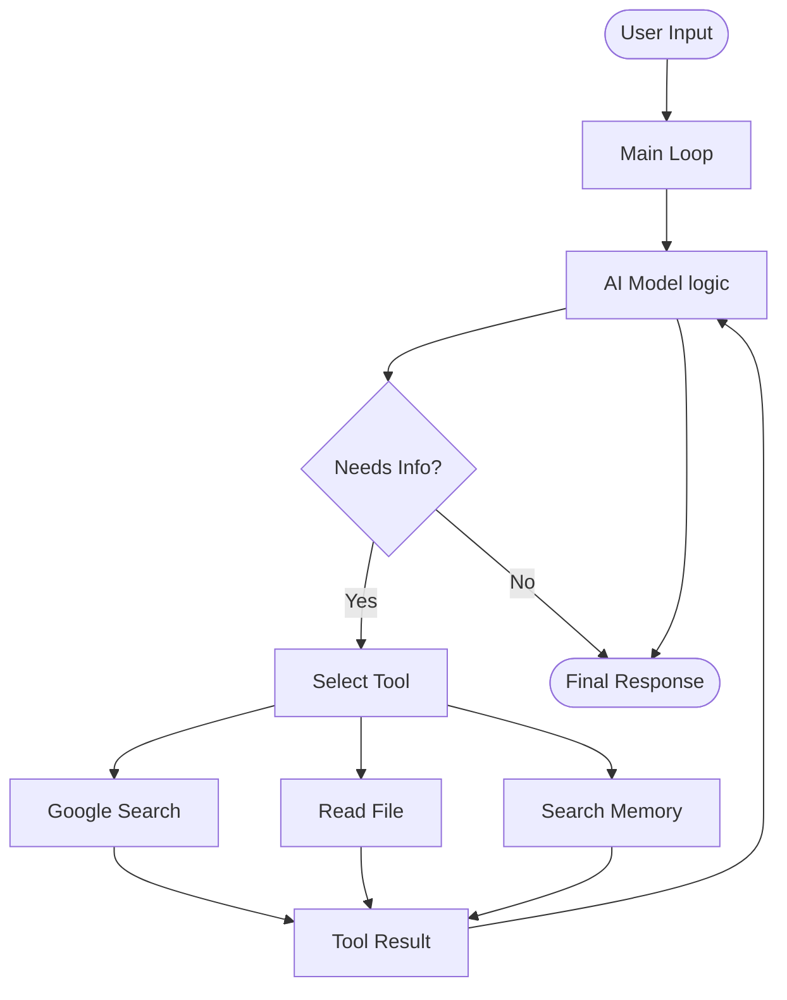
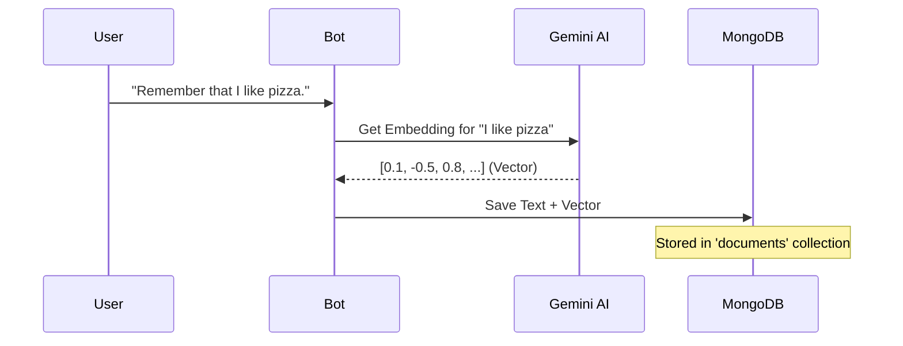

# Build Your Own AI Terminal Bot: A Step-by-Step Guide

Welcome! In this tutorial, you will build your very own **Artificial Intelligence Terminal Bot** completely from scratch. You will learn how to make it *remember* things using a database (Vector Search) and how to give it *tools* like searching the web.

**Target Audience:** Beginners (16+ suggested)  
**Tech Stack:** JavaScript (Node.js), npm, MongoDB, Google Gemini AI.

---

## 🏗️ Architecture

Before we code, let's understand how it works.

### 1. How the Bot Thinks (Flow Chart)



### 2. How the Bot Remembers (Vector Database)

When you tell the bot to "remember" something, it doesn't just save the text. It converts the text into a list of numbers called an **Embedding**. This represents the *meaning* of the text.



---

## 🛠️ Prerequisites

1.  **Node.js**: Download and install from [nodejs.org](https://nodejs.org/). (Version 18 or higher).
2.  **Code Editor**: [VS Code](https://code.visualstudio.com/) is recommended.
3.  **Accounts**:
    *   **Google Cloud** (for AI & Search keys).
    *   **MongoDB Atlas** (Free database).

---

## 🚀 Step 1: Project Setup

Open your terminal (Command Prompt or Shell) and run these commands to set up your project folder.

1.  **Create the folder**:
    ```bash
    mkdir my-ai-bot
    cd my-ai-bot
    ```

2.  **Initialize npm**:
    This creates a `package.json` file which keeps track of your libraries.
    ```bash
    npm init -y
    ```

3.  **Install Libraries**:
    We need a few power tools:
    *   `@google/generative-ai`: To talk to Gemini.
    *   `mongodb`: To talk to our database.
    *   `dotenv`: To keep our passwords safe.
    *   `readline`: Built-in, but we'll use it in code.

    Run this:
    ```bash
    npm install @google/generative-ai mongodb dotenv
    ```

4.  **Configure Imports**:
    Open `package.json` in VS Code and add `"type": "module"` so we can use modern `import` statements.

    ```json
    {
        "name": "bot",
        "version": "1.0.0",
        "description": "chat-bot",
        "license": "ISC",
        "author": "",
        "type": "module",
        "main": "index.js",
        "scripts": {
            "test": "echo \"Error: no test specified\" && exit 1"
        },
        "dependencies": {
            "@google/generative-ai": "^0.24.1",
            "dotenv": "^17.2.3",
            "mongodb": "^7.0.0"
        }
    }
    ```

---

## 🔑 Step 2: Getting the Keys

This is the most important setup part. We need "Secret Keys" to access services.

### A. Google Gemini API Key
1.  Go to [Google AI Studio](https://aistudio.google.com/).
2.  Click **"Get API key"**.
3.  Create a key in a new project.
4.  **Copy the key**.

### B. MongoDB Connection String
1.  Go to [MongoDB Atlas](https://www.mongodb.com/atlas/database) and sign up/login.
2.  **Create a Cluster**: Choose the free "Shared" tier (M0 Sandbox).
3.  **Create User**: Go to "Database Access" -> Add New Database User. (Remember parts of username/password!).
4.  **Allow Access**: Go to "Network Access" -> Add IP Address -> "Allow Access from Anywhere" (0.0.0.0/0) for simplicity.
5.  **Get String**: Click "Connect" on your cluster -> "Drivers" -> Copy the string. It looks like: `mongodb+srv://<user>:<password>@cluster0...`.
    *   *Replace `<password>` with your actual password!*

### C. Google Search (Optional but cool)
1.  Go to [Programmable Search Engine](https://programmablesearchengine.google.com/).
2.  Create a new search engine, select "Search the entire web".
3.  Copy the **"Search Engine ID" (CX)**.
4.  Go to [Google Custom Search API](https://developers.google.com/custom-search/v1/overview) and click "Get a Key".

### Save them in `.env`
Create a new file named `.env` in your project folder and paste your keys:

```ini
GEMINI_API_KEY=your_gemini_key_here
MONGODB_URI=your_mongodb_connection_string_here
GOOGLE_SEARCH_KEY=your_search_api_key
GOOGLE_SEARCH_CX=your_search_engine_id
```

---

## 🗄️ Step 3: Setting up Vector Database

We need to tell MongoDB how to search for "similarity" (Vectors).

1.  In MongoDB Atlas, go to your Cluster -> **"Atlas Search"** tab.
2.  Click **"Create Search Index"**.
3.  Choose **"JSON Editor"**.
4.  Select database `cmdbot` (or whatever you use) and collection `documents`. (If they don't exist, create them in "Collections" tab first).
5.  Name the index: `vector_index`.
6.  Paste this configuration:

```json
"fields": [
    {
      "numDimensions": 768,
      "path": "embedding",
      "similarity": "cosine",
      "type": "vector"
    }
  ]
```
*Note: We use 768 because that's the size of Gemini's `text-embedding-004` model output.*

---

## 🧑‍💻 Step 4: The Code

We will split our code into 4 files to keep it clean.

### File 1: `src/ai.js`
*This handles connecting to Google Gemini.*

```javascript
import { GoogleGenerativeAI } from "@google/generative-ai";
import dotenv from "dotenv";
dotenv.config();

const apiKey = process.env.GEMINI_API_KEY;
if (!apiKey) {
  console.error("Please set GEMINI_API_KEY in .env");
  process.exit(1);
}

const genAI = new GoogleGenerativeAI(apiKey);

// Model for creating memories (vectors)
export const textEmbeddingModel = genAI.getGenerativeModel({ model: "text-embedding-004" });

// Model for chatting
export const chatModel = genAI.getGenerativeModel({ model: "gemini-2.5-flash" });

// Helper to turn text into numbers
export async function getEmbedding(text) {
  const result = await textEmbeddingModel.embedContent(text);
  return result.embedding.values;
}
```

### File 2: `src/db.js`
*This handles saving and searching memories in MongoDB.*

```javascript
import { MongoClient } from "mongodb";
import dotenv from "dotenv";
import { getEmbedding } from "./ai.js";
dotenv.config();

const uri = process.env.MONGODB_URI;
const client = new MongoClient(uri);
const dbName = "cmdbot";

let db = client.db(dbName);
let docsColl = db.collection("documents");

export async function connectDB() {
  try {
    await client.connect();
    console.log("✅ Connected to MongoDB");
    db = client.db(dbName);
    docsColl = db.collection("documents");
  } catch (error) {
    console.error("❌ DB Connection failed:", error);
  }
}

export async function addDocument(content) {
  const embedding = await getEmbedding(content);
  await docsColl.insertOne({
    content,
    embedding,
    createdAt: new Date()
  });
  console.log("💾 Saved to memory.");
}

export async function searchDocuments(query) {
  try {
    const embedding = await getEmbedding(query);
    
    // Atlas Vector Search Pipeline
    const pipeline = [
      {
        $vectorSearch: {
          index: "vector_index",
          path: "embedding",
          queryVector: embedding,
          numCandidates: 100,
          limit: 3
        }
      },
      { $project: { _id: 0, content: 1 } }
    ];

    const results = await docsColl.aggregate(pipeline).toArray();
    return results.map(r => r.content);
  } catch (e) {
    console.error("Search failed (Did you create the Atlas Index?):", e);
    return [];
  }
}
```

### File 3: `src/tools.js`
*These are the "skills" the bot can use.*

```javascript
import { searchDocuments, addDocument } from "./db.js";

// 1. Define the tools for the AI to understand
export const toolsDeclaration = [
  {
    functionDeclarations: [
      {
        name: "search_knowledge_base",
        description: "Search internal memory for facts you saved previously.",
        parameters: {
          type: "OBJECT",
          properties: {
            query: { type: "STRING" }
          },
          required: ["query"]
        }
      },
      {
        name: "save_memory",
        description: "Save important information to your long-term memory.",
        parameters: {
          type: "OBJECT",
          properties: {
            info: { type: "STRING", description: "The fact to save" }
          },
          required: ["info"]
        }
      },
      {
        name: "google_search",
        description: "Search the web for real-time info.",
        parameters: {
          type: "OBJECT",
          properties: {
            query: { type: "STRING" }
          },
          required: ["query"]
        }
      }
    ]
  }
];

// 2. Define the actual code that runs
export const functions = {
  search_knowledge_base: async ({ query }) => {
    const results = await searchDocuments(query);
    return results.length ? results.join("\n") : "No matching memory found.";
  },
  
  save_memory: async ({ info }) => {
    await addDocument(info);
    return "Saved to memory!";
  },

  google_search: async ({ query }) => {
    const key = process.env.GOOGLE_SEARCH_KEY;
    const cx = process.env.GOOGLE_SEARCH_CX;
    if (!key || !cx) return "Error: Search keys missing.";

    try {
      const url = `https://www.googleapis.com/customsearch/v1?key=${key}&cx=${cx}&q=${encodeURIComponent(query)}`;
      const res = await fetch(url);
      const data = await res.json();
      if (!data.items) return "No results found.";
      return data.items.slice(0, 3).map(item => `Title: ${item.title}\nSnippet: ${item.snippet}\nLink: ${item.link}`).join("\n\n");
    } catch (e) {
      return "Search failed: " + e.message;
    }
  }
};
```

### File 4: `index.js` (The Main App)
*Putting it all together.*

```javascript
import readline from "readline";
import { chatModel } from "./src/ai.js";
import { connectDB } from "./src/db.js";
import { toolsDeclaration, functions } from "./src/tools.js";

async function startBot() {
  await connectDB();

  // Start a chat session with tools enabled
  const chat = chatModel.startChat({
    tools: toolsDeclaration
  });

  const rl = readline.createInterface({
    input: process.stdin,
    output: process.stdout
  });

  console.log("\n🤖 Bot is ready! Type 'exit' to quit.\n");
  process.stdout.write("You: ");

  rl.on("line", async (line) => {
    const input = line.trim();
    if (input === "exit") process.exit(0);

    try {
      // 1. Send message to AI
      let result = await chat.sendMessage(input);
      let response = await result.response;
      let text = response.text();

      // 2. Loop to handle function calls (Function Calling)
      while (response.functionCalls()) {
        const calls = response.functionCalls();
        if (!calls) break;

        const toolResponses = [];
        
        for (const call of calls) {
          const fnName = call.name;
          const fnArgs = call.args;
          console.log(`> ⚙️ Running tool: ${fnName}...`);

          // Run the tool function
          if (functions[fnName]) {
            const toolResult = await functions[fnName](fnArgs);
            toolResponses.push({
              functionResponse: {
                name: fnName,
                response: { result: toolResult }
              }
            });
          } else {
             toolResponses.push({
              functionResponse: {
                name: fnName,
                response: { error: "Tool not found" }
              }
            });
          }
        }

        // 3. Send tool results back to AI
        result = await chat.sendMessage(toolResponses);
        response = await result.response;
        text = response.text();
      }

      console.log(`Bot: ${text}`);
    } catch (err) {
      console.error("Error:", err.message);
    }
    
    process.stdout.write("\nYou: ");
  });
}

startBot();
```

---

## 🏃‍♂️ Step 5: Running It

1.  Make sure your `.env` file has keys.
2.  Run the app:
    ```bash
    node index.js
    ```
3.  **Test It**:
    *   **User**: "My favorite color is blue."
    *   **Bot**: "Okay, I'll remember that." (Should trigger `save_memory`)
    *   *Restart the bot (Ctrl+C, then run again)*
    *   **User**: "What is my favorite color?"
    *   **Bot**: (Searches memory) "Your favorite color is blue!"

## 🎉 Congratulations!

You just built a context-aware AI agent with long-term vector memory. You can expand this by adding more tools like:
*   Standard Google Search (using the API keys from Step 2).
*   File reading (using `fs.readFileSync`).
*   Home automation control.
